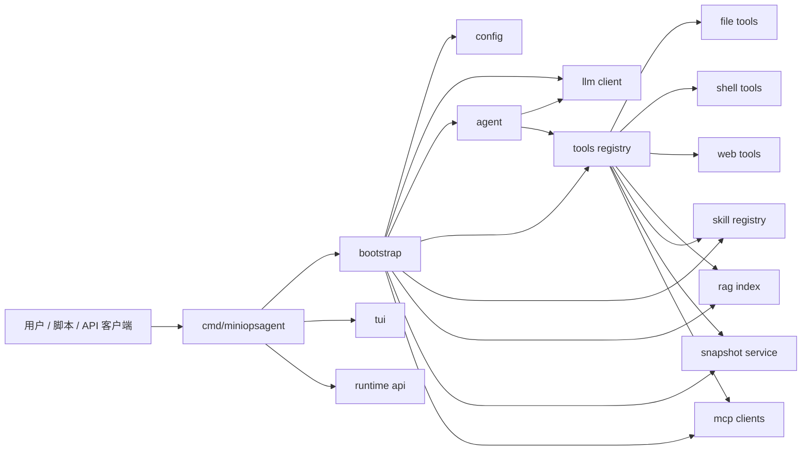
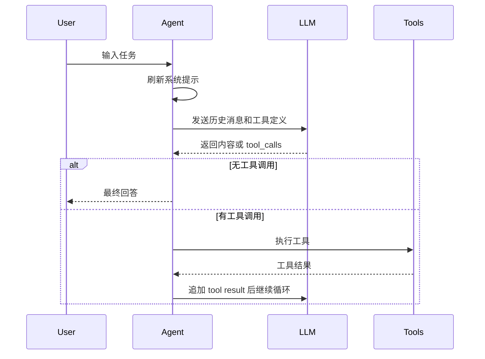

# MiniOpsAgent 架构设计

本文档说明 MiniOpsAgent 的设计目标、模块划分、核心流程和后续扩展方向。

## 1. 设计目标

MiniOpsAgent 的目标不是做大而全的平台，而是做一个足够清楚的小型运维 Agent：

- 终端优先：所有核心能力先能在 CLI 中跑通。
- 本地优先：默认操作当前工作区，不依赖数据库和后台服务。
- 可学习：模块拆分清楚，便于阅读 Agent、工具调用和 Runtime 实现。
- 可扩展：保留 MCP、Skill、Runtime API 这些扩展入口。
- 有边界：不把学习项目包装成生产级 AIOps。

## 2. 总体架构



## 3. 模块划分

| 模块 | 责任 |
| --- | --- |
| `cmd/miniopsagent` | CLI 命令注册、启动参数、环境组装 |
| `internal/config` | 默认配置、配置文件、环境变量覆盖 |
| `internal/llm` | OpenAI-compatible 请求、SSE 流式解析、tool call 组装 |
| `internal/agent` | ReAct 循环、Plan 模式、Team 模式、系统提示、记忆注入 |
| `internal/tools` | 工具定义、工具执行、安全策略、审计、MCP 和 Web 工具 |
| `internal/rag` | 本地代码索引、词频检索、Go 符号关系 |
| `internal/skill` | Skill 扫描、frontmatter 解析、按需加载 |
| `internal/snapshot` | 工作区快照创建和恢复 |
| `internal/runtime` | 本地 HTTP API，提供 threads、turns、events |
| `internal/tui` | Bubble Tea 全屏终端界面 |

## 4. 启动设计

启动入口是 `cmd/miniopsagent/main.go`。

`bootstrap` 会做这些事情：

1. 加载配置。
2. 创建 LLM client。
3. 扫描 Skill。
4. 加载本地 RAG 索引。
5. 创建长期记忆存储。
6. 创建快照服务。
7. 注册内置工具。
8. 加载 MCP 工具。
9. 创建 Agent。

这样设计的好处是：CLI、TUI 和 Runtime API 可以复用同一套 Agent 环境。

## 5. Agent 流程



ReAct 循环最多 10 次，并记录重复工具调用。如果模型重复调用完全相同的工具，Agent 会停止工具调用并要求模型基于已有上下文输出最终回答。

## 6. 工具系统设计

工具系统的核心是 `Registry`。

每个工具包含：

```text
Name         工具名
Description  工具说明
Parameters   JSON schema
Executor     Go 函数
Dangerous    是否危险
```

工具分组：

- 文件工具：读写文件、列目录、glob、grep。
- 命令工具：执行本地命令。
- Web 工具：搜索和抓取网页。
- RAG 工具：查询本地代码索引。
- Skill 工具：保存记忆和加载 Skill。
- Snapshot 工具：恢复快照。
- MCP 工具：动态注册远端 MCP server 的工具。

危险工具会写入审计日志。

## 7. 安全设计

MiniOpsAgent 当前有四层基础安全约束。

### PathGuard

文件工具只能访问工作区内路径。路径会被清理、转成绝对路径，并检查是否逃逸工作区。已存在路径还会做 symlink 解析。

### CommandGuard

命令工具会拒绝明显危险命令，例如：

```text
sudo
rm -rf /
mkfs
dd of=/dev/
curl | sh
shutdown
reboot
chmod 777 /
find /
```

### Web SSRF 防护

`web_fetch` 只允许公开 Web 地址。它会阻止：

- 非 HTTP/HTTPS scheme。
- localhost。
- loopback。
- 私网地址。
- link-local 地址。
- DNS 解析到非公网 IP 的域名。

### 审计日志

危险工具和 MCP 工具调用会写入：

```text
~/.miniopsagent/audit/YYYY-MM-DD.jsonl
```

日志记录工具名、结果、参数 hash 和耗时。

## 8. Runtime API 设计

Runtime API 是本地轻量服务，主要用于演示如何把 Agent 接入外部系统。

接口：

```text
POST /v1/threads
POST /v1/threads/{id}/turns
GET  /v1/threads/{id}/events
```

认证方式：

```text
Authorization: Bearer <MINIOPS_RUNTIME_API_KEY>
X-MiniOpsAgent-API-Key: <MINIOPS_RUNTIME_API_KEY>
```

当前实现是内存态，服务重启后 thread 和 event 会丢失。后续可以扩展为 SQLite。

## 9. 为什么保持小型

同类项目里常见的完整 AIOps 平台会包含 React 前端、Java 控制面、Go Worker、MySQL、Redis、MinIO、审批、RBAC、Runbook DAG、Prometheus/Loki/Kubernetes 连接器等。MiniOpsAgent 不做这些，是为了保留学习价值：

- 更容易读完。
- 更容易调试。
- 更容易改造成自己的工具。
- 不需要复杂基础设施。

## 10. 后续演进路线

推荐演进顺序：

1. 增加结构化 run log。
2. Runtime API 使用 SQLite 持久化。
3. `/events` 改成真正持续 SSE。
4. 给 `execute_command` 增加可配置 allowlist/denylist。
5. 快照恢复增加 dry-run 和删除新增文件策略。
6. RAG 接入 embedding。
7. 增加安装脚本和 release 构建。
